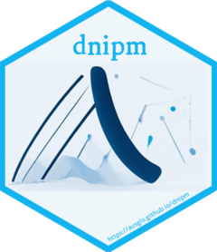

```{r setup, include = FALSE}
knitr::opts_chunk$set(echo = TRUE,
                      dpi = 300,
                      warning = FALSE,
                      message = FALSE,
                      out.width = "100%",
                      out.height = "100%",
                      fig.align = 'center',
                      comment = "##")
```

```r
library(showtext)
showtext_auto(enable = TRUE)
font_add("ShineTypewriter", regular = "./ShineTypewriter-lgwzd.ttf")
library(hexSticker)
library(magick)

sticker(
  subplot = "./bg_chatglm.png",
  s_x = 0.985,
  s_y = 0.995,
  s_width = .8,
  s_height = .8,
  package = "dnipm",
  p_family = "ShineTypewriter",
  p_size = 16.5,
  p_color = ggplot2::alpha("#0ab1f0",.95),#ggplot2::alpha("#3e3221",.75),
  p_x = 1.01,
  p_y = 1.65,
  dpi = 300,
  asp = 1,
  h_size = 1.75,
  h_color = ggplot2::alpha("#0ab1f0",.95),
  h_fill = ggplot2::alpha('#eaf3f8',0.75),
  white_around_sticker = F,
  url = "https://ausgis.github.io/dnipm",
  u_color = ggplot2::alpha("#0ab1f0",.95),
  u_size = 4.2,
  filename = "dnipm_logo.png"
)

image_read('./dnipm_logo.png') |> 
  image_resize("240x278")|> 
  image_write('./dnipm_logo.png')
```

